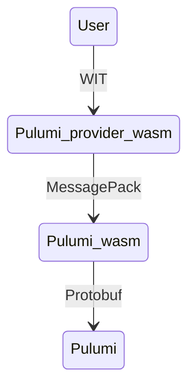

Conversion from MessagePack to Protobuf is lossy - we lose information about numbers - Protobuf Struct has only one number type.

From my tests serde can assign integers to floats, but not in reverse.