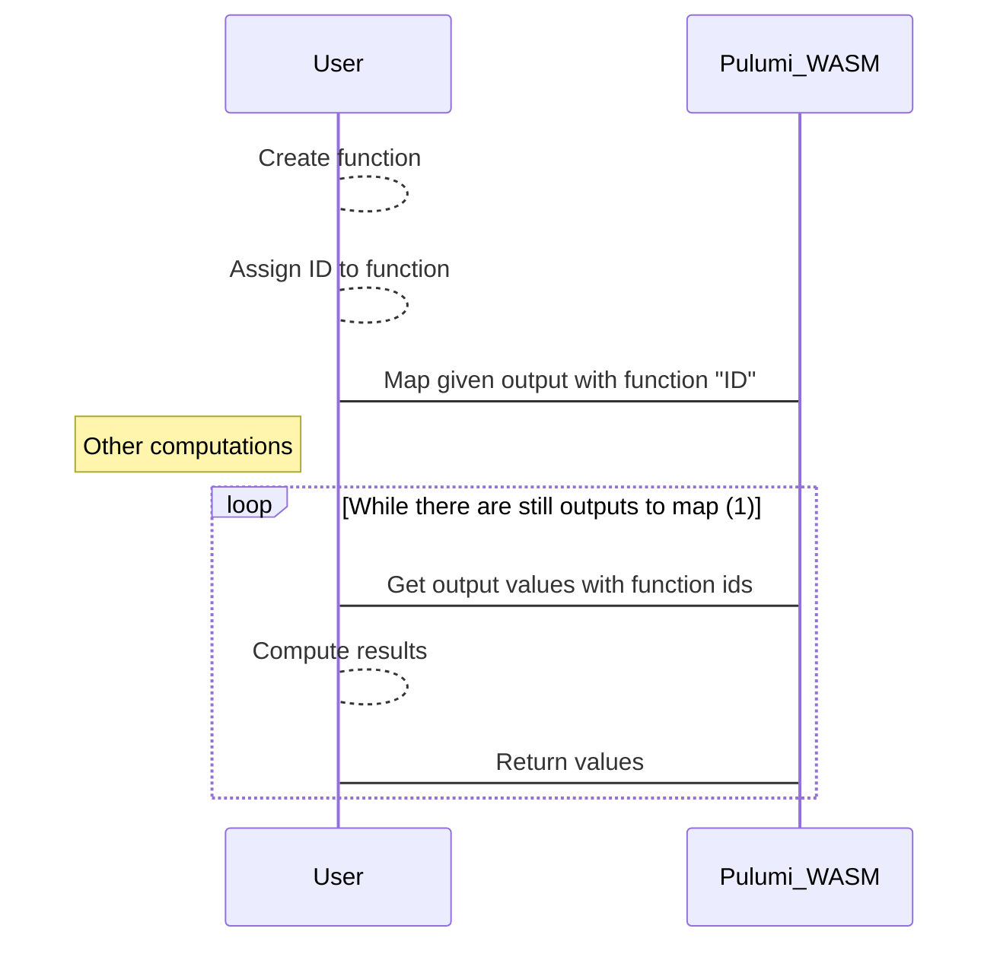

# Outputs

## Types of Output

Pulumi WASM has 4 types of outputs:
1. Done
2. Mapped
3. Func
4. Unknown

### Done

This is output for which value is known. Internally it's represented as MessagePack's `Value`.

### Mapped

This is output which wait to be mapped by host. More details are in [Mapping](#Mapping) section. Internally it's represented as tuple of function name and output which will values will be it's argument.

### Func

This is output that is a function. As opposed to `Mapped` this function in executed internally in Pulumi WASM. Currently these are
functions that creates resources. Internally it's tuple of list of outputs and function that handles their values.

### Unknown

This is output for which value will never be known. This is used in Pulumi's preview stage.

## Mapping

One of Pulumi features is allowing transforming values in programming languages as opposed to 
configuration language like in Terraform. While it's obvious how to do that when everything is written in one language
in Pulumi WASM it's not the case - internals are written in Rust compiled to WASM, while user code
can be written in any language that can be compiled to WASM. 

To handle it mapping value has 2 stages:

1. Save function in global map (in functional languages it may be monad)
2. Iterating over all values that be mapped and invoking function on it.

Simplified sequence diagram of this process:

(1) Outputs ready to be mapped are of type `Func` for which input is type `Done`

Currently due to single threaded nature of WASM this operation is done at the end of the program.